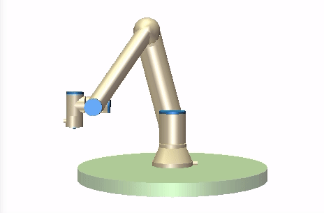
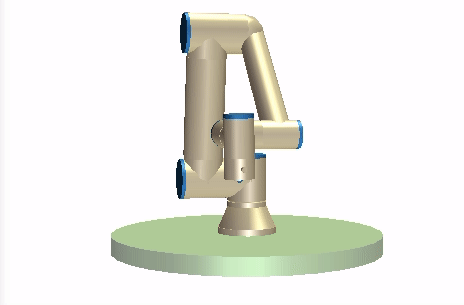

********
Examples
********
This section contains examples of how to use the :ref:`RTDE Control Interface <rtde-control-api>` the
:ref:`RTDE Receive Interface <rtde-receive-api>` and the :ref:`RTDE IO Interface <rtde-io-api>`.

.. warning::
   It is your own responsibility to verify that the movements performed by these examples are collision-free and safe
   to execute on the robot. When in doubt, use the simulator provided by Universal Robots.

.. role:: bash(code)
   :language: bash

.. role:: cmake_inline(code)
   :language: cmake

CMake Example
=============
Once you have installed the ur_rtde library. You can use the cmake command find_package() to locate the library.
Here is an example of how to find the library and link it against your C++ executable.

.. code-block:: cmake

   cmake_minimum_required(VERSION 3.5)
   project(ur_rtde_cmake_example)

   find_package(ur_rtde REQUIRED)
   add_executable(ur_rtde_cmake_example main.cpp)
   target_link_libraries(ur_rtde_cmake_example PRIVATE ur_rtde::rtde)

if the library is not installed or installed to a none standard system path, use one of the following methods:

*  Call CMake with :bash:`-Dur_rtde_DIR=/path/to/ur_rtde`
*  Set the path in :bash:`find_package()`:

   find_package(ur_rtde REQUIRED PATHS "/a/possible/path/to/ur_rtde" "/another/possible/path/to/ur_rtde")

The path to ur_rtde is the one where ur_rtdeTargets.cmake can be found. For a none install it should be
:file:`/path/to/ur_rtde/Build/ur_rtde`. For an install it is :file:`/path/to/lib/cmake/ur_rtde`.

Basic use
=========
Simple example using the RTDE Control Interface to move the robot to a pose with the **moveL** command.

C++:

.. code-block:: c++

   // The constructor simply takes the IP address of the Robot
   RTDEControlInterface rtde_control("127.0.0.1");
   // First argument is the pose 6d vector followed by speed and acceleration
   rtde_control.moveL({-0.143, -0.435, 0.20, -0.001, 3.12, 0.04}, 0.5, 0.2);

Python:

.. code-block:: python

   import rtde_control
   rtde_c = rtde_control.RTDEControlInterface("127.0.0.1")
   rtde_c.moveL([-0.143, -0.435, 0.20, -0.001, 3.12, 0.04], 0.5, 0.3)

Simple example using the RTDE Receive Interface to get the joint positions of the robot

C++:

.. code-block:: c++

   /* The constructor takes the IP address of the robot, by default all variables are
    * transmitted. Optionally only a subset of variables, specified by a vector, are transmitted.
    */
   RTDEReceiveInterface rtde_receive("127.0.0.1");
   std::vector<double> joint_positions = rtde_receive.getActualQ();

Python:

.. code-block:: python

   import rtde_receive
   rtde_r = rtde_receive.RTDEReceiveInterface("127.0.0.1")
   actual_q = rtde_r.getActualQ()

Simple example using the RTDE IO Interface to set a standard digital output.

C++:

.. code-block:: c++

   // The constructor simply takes the IP address of the Robot
   RTDEIOInterface rtde_io("127.0.0.1");
   rtde_io.setStandardDigitalOut(7, true);

Python:

.. code-block:: python

   import rtde_io
   rtde_io = rtde_io.RTDEIOInterface("127.0.0.1")
   rtde_io.setStandardDigitalOut(7, True)

.. note::
   When using an e-Series robot data will be received at the maximum available frequency (500Hz), for a CB3
   robot the frequency will be (125Hz).

.. _move-asynchronous-example:

Move Asynchronous Example
=========================
This example will perform two asynchronous movements, first one by **moveJ**, followed by a movement with **moveL**.
Both movements are stopped before reaching the targets with **stopJ** and **stopL** respectively.

C++:

.. code-block:: c++

   #include <ur_rtde/rtde_control_interface.h>
   #include <ur_rtde/rtde_receive_interface.h>

   #include <thread>
   #include <chrono>

   using namespace ur_rtde;
   using namespace std::chrono;

   int main(int argc, char* argv[])
   {
     RTDEControlInterface rtde_control("127.0.0.1");
     RTDEReceiveInterface rtde_receive("127.0.0.1");
     std::vector<double> init_q = rtde_receive.getActualQ();

     // Target in the robot base
     std::vector<double> new_q = init_q;
     new_q[0] += 0.2;

     /**
      * Move asynchronously in joint space to new_q, we specify asynchronous behavior by setting the async parameter to
      * 'true'. Try to set the async parameter to 'false' to observe a default synchronous movement, which cannot be
      * stopped by the stopJ function due to the blocking behaviour.
      */
     rtde_control.moveJ(new_q, 1.05, 1.4, true);
     std::this_thread::sleep_for(std::chrono::milliseconds(200));
     // Stop the movement before it reaches new_q
     rtde_control.stopJ(0.5);

     // Target 10 cm up in the Z-Axis of the TCP
     std::vector<double> target = rtde_receive.getActualTCPPose();
     target[2] += 0.10;

     /**
      * Move asynchronously in cartesian space to target, we specify asynchronous behavior by setting the async parameter
      * to 'true'. Try to set the async parameter to 'false' to observe a default synchronous movement, which cannot be
      * stopped by the stopL function due to the blocking behaviour.
      */
     rtde_control.moveL(target, 0.25, 0.5, true);
     std::this_thread::sleep_for(std::chrono::milliseconds(200));
     // Stop the movement before it reaches target
     rtde_control.stopL(0.5);

     // Move to initial joint position with a regular moveJ
     rtde_control.moveJ(init_q);

     // Stop the RTDE control script
     rtde_control.stopScript();
     return 0;
   }

Python:

.. code-block:: python

   import rtde_control
   import rtde_receive
   import time

   rtde_c = rtde_control.RTDEControlInterface("127.0.0.1")
   rtde_r = rtde_receive.RTDEReceiveInterface("127.0.0.1")
   init_q = rtde_r.getActualQ()

   # Target in the robot base
   new_q = init_q[:]
   new_q[0] += 0.20

   # Move asynchronously in joint space to new_q, we specify asynchronous behavior by setting the async parameter to
   # 'True'. Try to set the async parameter to 'False' to observe a default synchronous movement, which cannot be stopped
   # by the stopJ function due to the blocking behaviour.
   rtde_c.moveJ(new_q, 1.05, 1.4, True)
   time.sleep(0.2)
   # Stop the movement before it reaches new_q
   rtde_c.stopJ(0.5)

   # Target in the Z-Axis of the TCP
   target = rtde_r.getActualTCPPose()
   target[2] += 0.10

   # Move asynchronously in cartesian space to target, we specify asynchronous behavior by setting the async parameter to
   # 'True'. Try to set the async parameter to 'False' to observe a default synchronous movement, which cannot be stopped
   # by the stopL function due to the blocking behaviour.
   rtde_c.moveL(target, 0.25, 0.5, True)
   time.sleep(0.2)
   # Stop the movement before it reaches target
   rtde_c.stopL(0.5)

   # Move back to initial joint configuration
   rtde_c.moveJ(init_q)

   # Stop the RTDE control script
   rtde_c.stopScript()

You can find the source code of this example under :file:`examples/cpp/move_async_example.cpp`, if you compiled
ur_rtde with examples you can run this example from the *bin* folder. If you want to run the python example
navigate to :file:`examples/py/` and run :bash:`python3 move_async_example.py`.

Forcemode Example
=================
This example will start moving the robot downwards with -10N in the z-axis for 2 seconds, followed by a move
upwards with 10N in the z-axis for 2 seconds.

You can find the source code of this example under :file:`examples/cpp/forcemode_example.cpp`, if you compiled
ur_rtde with examples you can run this example from the *bin* folder. If you want to run the python example
navigate to :file:`examples/py/` and run :bash:`python3 forcemode_example.py`.

C++:

.. code-block:: c++

   #include <ur_rtde/rtde_control_interface.h>
   #include <thread>
   #include <chrono>

   using namespace ur_rtde;
   using namespace std::chrono;

   int main(int argc, char* argv[])
   {
     RTDEControlInterface rtde_control("127.0.0.1");

     // Parameters
     std::vector<double> task_frame = {0, 0, 0, 0, 0, 0};
     std::vector<int> selection_vector = {0, 0, 1, 0, 0, 0};
     std::vector<double> wrench_down = {0, 0, -10, 0, 0, 0};
     std::vector<double> wrench_up = {0, 0, 10, 0, 0, 0};
     int force_type = 2;
     double dt = 1.0/500; // 2ms
     std::vector<double> limits = {2, 2, 1.5, 1, 1, 1};
     std::vector<double> joint_q = {-1.54, -1.83, -2.28, -0.59, 1.60, 0.023};

     // Move to initial joint position with a regular moveJ
     rtde_control.moveJ(joint_q);

     // Execute 500Hz control loop for a total of 4 seconds, each cycle is ~2ms
     for (unsigned int i=0; i<2000; i++)
     {
       auto t_start = high_resolution_clock::now();
       // First we move the robot down for 2 seconds, then up for 2 seconds
       if (i > 1000)
         rtde_control.forceMode(task_frame, selection_vector, wrench_up, force_type, limits);
       else
         rtde_control.forceMode(task_frame, selection_vector, wrench_down, force_type, limits);
       auto t_stop = high_resolution_clock::now();
       auto t_duration = std::chrono::duration<double>(t_stop - t_start);

       if (t_duration.count() < dt)
       {
         std::this_thread::sleep_for(std::chrono::duration<double>(dt - t_duration.count()));
       }
     }

     rtde_control.forceModeStop();
     rtde_control.stopScript();

     return 0;
   }

Python:

.. code-block:: python

   import rtde_control
   import time

   rtde_c = rtde_control.RTDEControlInterface("127.0.0.1")

   task_frame = [0, 0, 0, 0, 0, 0]
   selection_vector = [0, 0, 1, 0, 0, 0]
   wrench_down = [0, 0, -10, 0, 0, 0]
   wrench_up = [0, 0, 10, 0, 0, 0]
   force_type = 2
   limits = [2, 2, 1.5, 1, 1, 1]
   dt = 1.0/500  # 2ms
   joint_q = [-1.54, -1.83, -2.28, -0.59, 1.60, 0.023]

   # Move to initial joint position with a regular moveJ
   rtde_c.moveJ(joint_q)

   # Execute 500Hz control loop for 4 seconds, each cycle is 2ms
   for i in range(2000):
       start = time.time()
       # First move the robot down for 2 seconds, then up for 2 seconds
       if i > 1000:
           rtde_c.forceMode(task_frame, selection_vector, wrench_up, force_type, limits)
       else:
           rtde_c.forceMode(task_frame, selection_vector, wrench_down, force_type, limits)
       end = time.time()
       duration = end - start
       if duration < dt:
           time.sleep(dt - duration)

   rtde_c.forceModeStop()
   rtde_c.stopScript()

Intended movement:

.. image:: ../_static/force_mode_example.gif

ServoJ Example
==============
This example will use the **servoJ** command to move the robot, where incremental changes are made to the base and
shoulder joint continuously in a 500Hz control loop for 2 seconds.

You can find the source code of this example under :file:`examples/cpp/servoj_example.cpp`, if you compiled
ur_rtde with examples you can run this example from the *bin* folder. If you want to run the python example
navigate to :file:`examples/py/` and run :bash:`python3 servoj_example.py`.

C++:

.. code-block:: c++

   #include <ur_rtde/rtde_control_interface.h>
   #include <thread>
   #include <chrono>

   using namespace ur_rtde;
   using namespace std::chrono;

   int main(int argc, char* argv[])
   {
     RTDEControlInterface rtde_control("127.0.0.1");

     // Parameters
     double velocity = 0.5;
     double acceleration = 0.5;
     double dt = 1.0/500; // 2ms
     double lookahead_time = 0.1;
     double gain = 300;
     std::vector<double> joint_q = {-1.54, -1.83, -2.28, -0.59, 1.60, 0.023};

     // Move to initial joint position with a regular moveJ
     rtde_control.moveJ(joint_q);

     // Execute 500Hz control loop for 2 seconds, each cycle is ~2ms
     for (unsigned int i=0; i<1000; i++)
     {
       auto t_start = high_resolution_clock::now();
       rtde_control.servoJ(joint_q, velocity, acceleration, dt, lookahead_time, gain);
       joint_q[0] += 0.001;
       joint_q[1] += 0.001;
       auto t_stop = high_resolution_clock::now();
       auto t_duration = std::chrono::duration<double>(t_stop - t_start);

       if (t_duration.count() < dt)
       {
         std::this_thread::sleep_for(std::chrono::duration<double>(dt - t_duration.count()));
       }
     }

     rtde_control.servoStop();
     rtde_control.stopScript();

     return 0;
   }

Python:

.. code-block:: python

   import rtde_control
   import time

   rtde_c = rtde_control.RTDEControlInterface("127.0.0.1")

   # Parameters
   velocity = 0.5
   acceleration = 0.5
   dt = 1.0/500  # 2ms
   lookahead_time = 0.1
   gain = 300
   joint_q = [-1.54, -1.83, -2.28, -0.59, 1.60, 0.023]

   # Move to initial joint position with a regular moveJ
   rtde_c.moveJ(joint_q)

   # Execute 500Hz control loop for 2 seconds, each cycle is 2ms
   for i in range(1000):
       start = time.time()
       rtde_c.servoJ(joint_q, velocity, acceleration, dt, lookahead_time, gain)
       joint_q[0] += 0.001
       joint_q[1] += 0.001
       end = time.time()
       duration = end - start
       if duration < dt:
           time.sleep(dt - duration)

   rtde_c.servoStop()
   rtde_c.stopScript()

.. note::
   Remember that to allow for a fast control rate when servoing, the joint positions must be close to each other e.g.
   (dense trajectory). If the robot is not reaching the target fast enough try to increase the acceleration or the
   gain parameter.

Intended movement:

.. image:: ../_static/servoj_example.gif

SpeedJ Example
==============
This example will use the **speedJ** command to move the robot, where the first 2 joints are speeding continuously
in a 500Hz control loop for 2 seconds.

You can find the source code of this example under :file:`examples/cpp/speedj_example.cpp`, if you compiled
ur_rtde with examples you can run this example from the *bin* folder. If you want to run the python example
navigate to :file:`examples/py/` and run :bash:`python3 speedj_example.py`.

C++:

.. code-block:: c++

   #include <ur_rtde/rtde_control_interface.h>
   #include <thread>
   #include <chrono>

   using namespace ur_rtde;
   using namespace std::chrono;

   int main(int argc, char* argv[])
   {
     RTDEControlInterface rtde_control("127.0.0.1");

     // Parameters
     double acceleration = 0.5;
     double dt = 1.0/500; // 2ms
     std::vector<double> joint_q = {-1.54, -1.83, -2.28, -0.59, 1.60, 0.023};
     std::vector<double> joint_speed = {0.0, 0.0, 0.0, 0.0, 0.0, 0.0};

     // Move to initial joint position with a regular moveJ
     rtde_control.moveJ(joint_q);

     // Execute 500Hz control loop for 2 seconds, each cycle is ~2ms
     for (unsigned int i=0; i<1000; i++)
     {
       auto t_start = high_resolution_clock::now();
       rtde_control.speedJ(joint_speed, acceleration, dt);
       joint_speed[0] += 0.0005;
       joint_speed[1] += 0.0005;
       auto t_stop = high_resolution_clock::now();
       auto t_duration = std::chrono::duration<double>(t_stop - t_start);

       if (t_duration.count() < dt)
       {
         std::this_thread::sleep_for(std::chrono::duration<double>(dt - t_duration.count()));
       }
     }

     rtde_control.speedStop();
     rtde_control.stopScript();

     return 0;
   }

Python:

.. code-block:: python

   import rtde_control
   import time

   rtde_c = rtde_control.RTDEControlInterface("127.0.0.1")

   # Parameters
   acceleration = 0.5
   dt = 1.0/500  # 2ms
   joint_q = [-1.54, -1.83, -2.28, -0.59, 1.60, 0.023]
   joint_speed = [0.0, 0.0, 0.0, 0.0, 0.0, 0.0]

   # Move to initial joint position with a regular moveJ
   rtde_c.moveJ(joint_q)

   # Execute 500Hz control loop for 2 seconds, each cycle is 2ms
   for i in range(1000):
       start = time.time()
       rtde_c.speedJ(joint_speed, acceleration, dt)
       joint_speed[0] += 0.0005
       joint_speed[1] += 0.0005
       end = time.time()
       duration = end - start
       if duration < dt:
           time.sleep(dt - duration)

   rtde_c.speedStop()
   rtde_c.stopScript()

Intended movement:

MoveJ Path With Blending Example
================================
This example will use the **moveJ** command with a path, where each joint pose in the path has a defined velocity,
acceleration and blend. The joint poses in the path are defined by a 9-dimensional vector, where the first six
values constitutes the joint pose, followed by the last three values *velocity*, *acceleration* and *blend*.

You can find the source code of this example under :file:`examples/cpp/movej_path_with_blend_example.cpp`, if you compiled
ur_rtde with examples you can run this example from the *bin* folder. If you want to run the python example
navigate to :file:`examples/py/` and run :bash:`python3 movej_path_with_blend_example.py`.

C++:

.. code-block:: c++

   #include <ur_rtde/rtde_control_interface.h>

   using namespace ur_rtde;

   int main(int argc, char* argv[])
   {
     RTDEControlInterface rtde_control("127.0.0.1");

     double velocity = 0.5;
     double acceleration = 0.5;
     double blend_1 = 0.0;
     double blend_2 = 0.02;
     double blend_3 = 0.0;
     std::vector<double> path_pose1 = {-0.143, -0.435, 0.20, -0.001, 3.12, 0.04, velocity, acceleration, blend_1};
     std::vector<double> path_pose2 = {-0.143, -0.51, 0.21, -0.001, 3.12, 0.04, velocity, acceleration, blend_2};
     std::vector<double> path_pose3 = {-0.32, -0.61, 0.31, -0.001, 3.12, 0.04, velocity, acceleration, blend_3};

     std::vector<std::vector<double>> path;
     path.push_back(path_pose1);
     path.push_back(path_pose2);
     path.push_back(path_pose3);

     // Send a linear path with blending in between - (currently uses separate script)
     rtde_control.moveL(path);
     rtde_control.stopScript();

     return 0;
   }

Python:

.. code-block:: python

   import rtde_control

   rtde_c = rtde_control.RTDEControlInterface("127.0.0.1")

   velocity = 0.5
   acceleration = 0.5
   blend_1 = 0.0
   blend_2 = 0.02
   blend_3 = 0.0
   path_pose1 = [-0.143, -0.435, 0.20, -0.001, 3.12, 0.04, velocity, acceleration, blend_1]
   path_pose2 = [-0.143, -0.51, 0.21, -0.001, 3.12, 0.04, velocity, acceleration, blend_2]
   path_pose3 = [-0.32, -0.61, 0.31, -0.001, 3.12, 0.04, velocity, acceleration, blend_3]
   path = [path_pose1, path_pose2, path_pose3]

   # Send a linear path with blending in between - (currently uses separate script)
   rtde_c.moveL(path)
   rtde_c.stopScript()

Intended movement:

IO Example
==========
This example will print out the state of a standard digital output, change the state of that output and print the
state again. Furthermore it will set the current ratio of an analog output.

You can find the source code of this example under :file:`examples/cpp/io_example.cpp`, if you compiled
ur_rtde with examples you can run this example from the *bin* folder. If you want to run the python example
navigate to :file:`examples/py/` and run :bash:`python3 io_example.py`.

C++:

.. code-block:: c++

   #include <ur_rtde/rtde_io_interface.h>
   #include <ur_rtde/rtde_receive_interface.h>
   #include <iostream>
   #include <thread>

   using namespace ur_rtde;

   int main(int argc, char* argv[])
   {
     RTDEIOInterface rtde_io("127.0.0.1");
     RTDEReceiveInterface rtde_receive("127.0.0.1");

     /** How-to set and get standard and tool digital outputs. Notice that we need the
       * RTDEIOInterface for setting an output and RTDEReceiveInterface for getting the state
       * of an output.
       */

     if (rtde_receive.getDigitalOutState(7))
       std::cout << "Standard digital out (7) is HIGH" << std::endl;
     else
       std::cout << "Standard digital out (7) is LOW" << std::endl;

     if (rtde_receive.getDigitalOutState(16))
       std::cout << "Tool digital out (16) is HIGH" << std::endl;
     else
       std::cout << "Tool digital out (16) is LOW" << std::endl;

     rtde_io.setStandardDigitalOut(7, true);
     rtde_io.setToolDigitalOut(0, true);
     std::this_thread::sleep_for(std::chrono::milliseconds(10));

     if (rtde_receive.getDigitalOutState(7))
       std::cout << "Standard digital out (7) is HIGH" << std::endl;
     else
       std::cout << "Standard digital out (7) is LOW" << std::endl;

     if (rtde_receive.getDigitalOutState(16))
       std::cout << "Tool digital out (16) is HIGH" << std::endl;
     else
       std::cout << "Tool digital out (16) is LOW" << std::endl;

     // How to set a analog output with a specified current ratio
     rtde_io.setAnalogOutputCurrent(1, 0.25);

     return 0;
   }

Python:

.. code-block:: python

   import rtde_io
   import rtde_receive
   import time

   rtde_io_ = rtde_io.RTDEIOInterface("127.0.0.1")
   rtde_receive_ = rtde_receive.RTDEReceiveInterface("127.0.0.1")

   # How-to set and get standard and tool digital outputs. Notice that we need the
   # RTDEIOInterface for setting an output and RTDEReceiveInterface for getting the state
   # of an output.

   if rtde_receive_.getDigitalOutState(7):
       print("Standard digital out (7) is HIGH")
   else:
       print("Standard digital out (7) is LOW")

   if rtde_receive_.getDigitalOutState(16):
       print("Tool digital out (16) is HIGH")
   else:
       print("Tool digital out (16) is LOW")

   rtde_io_.setStandardDigitalOut(7, True)
   rtde_io_.setToolDigitalOut(0, True)
   time.sleep(0.01)

   if rtde_receive_.getDigitalOutState(7):
       print("Standard digital out (7) is HIGH")
   else:
       print("Standard digital out (7) is LOW")

   if rtde_receive_.getDigitalOutState(16):
       print("Tool digital out (16) is HIGH")
   else:
       print("Tool digital out (16) is LOW")

   # How to set a analog output with a specified current ratio
   rtde_io_.setAnalogOutputCurrent(1, 0.25)
